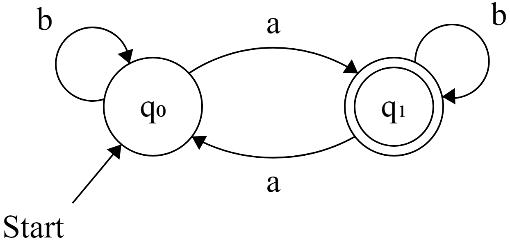

# a01-dfa

A _deterministic finite-state automata_ (DFA) is the simplest model for computation discussed in COMP 455. In class, we learned that an DFA consists of the following five components:
1. An input alphabet listing the symbols recognized by the machine.
2. A finite, non-empty set of states.
3. One special designated initial state.
4. Zero or more special designated accepting states.
5. A state transition function which describes how the machine responds to input symbols.

In this assignment, we will define a Java interface `DFA` that represents a DFA with methods for each of these five components. Next, we will define another interface `DFAExecutor` which represents the act of executing a DFA for a given input sequence. Finally, you will design and program a few of your own DFAs to accept certain input sequences.


## The DFA Interface

To get started, open and read through the `DFA.java` interface file provided in the `org.comp455.a01dfa` package. Notice that the interface defines five getter methods: `getAlphabet()`, `getStates()`, `getInitialState()`, `getAcceptingStates()`, and `getTransition()`. These methods correspond to the five components of a DFA.

For this assignment, we will model the states of a DFA as integer values (i.e. type `int`). For instance, a simple DFA might have three states: `0`, `1`, and `2`. The states supported by a DFA must be sequential, and must start with `0`.

We will model the symbols input to the machine as character values (i.e. type `char`). For instance, one DFA may recognize three different characters as valid input symbols: `'a'`, `'b'`, and `'c'`. Another machine might recognize two symbols: `'0'` and `'1'`. By modeling input symbols using characters, it allows us to easily refer to a sequence of input symbols by specifying a `String` value.


## `DFAImpl.java`

Add a new class to the `org.comp455.a01dfa` package called `DFAImpl` which implements the `DFA` interface (the file name should be `DFA.java`). Since this class will represent a DFA, it will need exactly five `private` instance fields corresponding to the five traits of every DFA (see above).

Your `DFAImpl` class should have a constructor with the following signature:
```java
public DFAImpl(char[] alphabet, int[] states, int initialState, int[] acceptingStates, int[][] transitions) {
  // Your constructor code goes here
}
```

The constructor's job is simply to initialize the DFA fields using the passed argument values. Most of these values should be self-explanatory. For instance, `alphabet` will be an array of the valid input symbols, and `states` will be an array containing the states used by the machine (i.e., for a machine with 3 states, `states` will be equal to `{0, 1, 2}`).

The `transitions` parameter is a 2-dimensional integer array (`int[][]`), which represents the _transition table_ used by the DFA. The first dimension of the array corresponds with the rows of the transition table (i.e. states), and the second dimension corresponds with the columns (i.e. input symbols). For example, if the machine uses alphabet `{'a', 'b', 'c'}`, is currently in state `2`, and experiences input symbol `'a'` (which is the 0th element of the alphabet array), then the next state could be found by accessing the following element of `transitions`:
```
transitions[2][0] // resolves to the next state of the DFA
```

When filling in the `getTransition(int state, char symbol)` method, you will need to use the provided state and symbol value to look up and return the next state from the transition table. You may wish to use the provided `lookup(char symbol)` default method, which looks up the index value for a given symbol character.

Before moving on to the next section, try submitting your code to Gradescope. It helps to make sure that your `DFAImpl` class is correct before moving on, because it verifies that you are thinking correctly about the transition table.


## The DFA Runner Interface

Once you've finished the `DFAImpl` class, open and read through the `Runner.java` interface file. A `Runner` represents the process of running a given DFA machine. Recall from class that when symbols are input into a DFA, the internal state will change according to the predetermined transitions defined by the transition function. That is the process that this class models.

Create a new class in the `org.comp455.a01dfa` package called `RunnerImpl` which implements the `Runner` interface (the file name should be `RunnerImpl.java`). This class should have exactly two `private` instance fields: one for storing the DFA that is being run, and another for storing the current state of the DFA.

Your `RunnerImpl` class should have a constructor with the following signature:
```java
public RunnerImpl(DFA machine) {
  // Your constructor code goes here
}
```

Like before, the constructor's job is to initialize the private instance fields. In this case, the DFA field should be set using the passed argument value, and the state field should be set to the starting state of the machine.

Before moving on to the next section, try submitting your code to Gradescope. It helps to make sure that your `RunnerImpl` class is correct before moving on, because it verifies that you are thinking correctly about how to use a DFA object.


## Exercises

Finally, after completing the `DFAImpl` and `RunnerImpl` classes, open up the `DFAExercises.java` file. For this portion of the assignment, your job is to design DFAs that accept certain languages. For each exercise, use your own `DFAImpl` class to create and return a DFA object that accepts the language specified in the comments.

There are 8 exercises in total, which means you will need to design 8 different DFAs. To make this process clear, an example is given below.

```java
// This method should create and return a DFA using the following alphabet:
//   Σ = { a, b }
// The returned DFA should be an acceptor for the following language:
//   L = { x | x has an odd number of 'a's }
public static DFA ex00() {
  return null; // Replace this line with your solution for ex00
}
```

Before writing code, it helps to start by designing a transition diagram with pen and paper that accepts the language. Here is a solution DFA for the problem above.



Next, convert the transition diagram to the following transition table:

|      | `a`  | `b`  |
| ---- | ---- | ---- |
| `q0` | `q1` | `q0` |
| `q1` | `q0` | `q1` |

Finally, this corresponds with the following code which is the solution to the exercise:

```java
char[] alphabet = {'a', 'b'};
int[] states = {0, 1};
int startState = 0;
int[] acceptingStates = {1};
int[][] transitions = {
  {1, 0},
  {0, 1},
};
return new DFAImpl(alphabet, states, startState, acceptingStates, transitions);
```